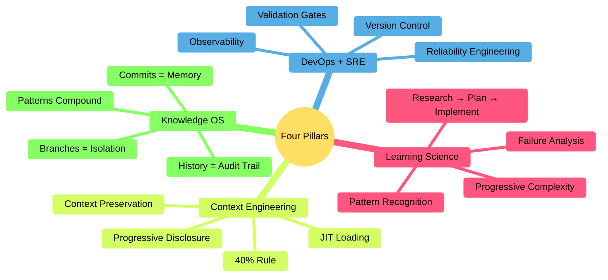
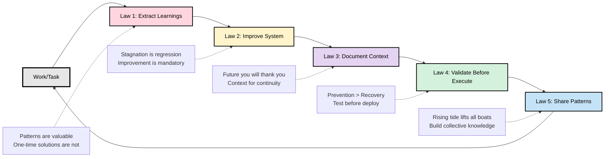
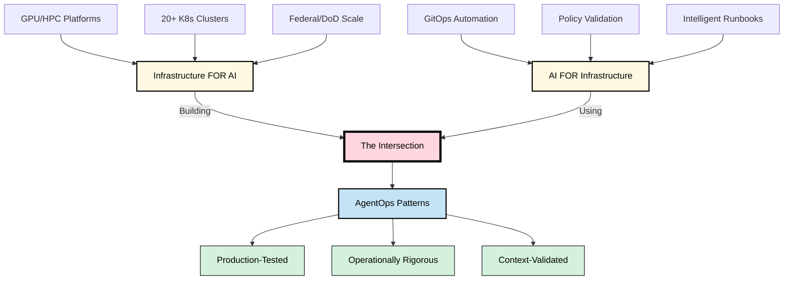

<!--
SEO Metadata:
Title: 12-Factor AgentOps - Operational Framework for AI Agents
Description: Apply DevOps + SRE principles to AI agent operations. Philosophy, patterns, and research for reliable, observable, and improving agent systems.
Keywords: agentops, ai agents, devops, sre, operational patterns, context engineering, knowledge os, agent orchestration, 12-factor
Category: Framework, Documentation, Research
-->

# 12-Factor AgentOps

<div align="center">

**Operational framework for AI agents — philosophy, patterns, and principles**

<a href="https://www.apache.org/licenses/LICENSE-2.0">
    </a>
<a href="https://creativecommons.org/licenses/by-sa/4.0/">
    </a>


</div>

---

> [!IMPORTANT]
> **This is the framework repository** — philosophy, patterns, and research.
>
> **For working tools and implementation** → See [agentops](https://github.com/boshu2/agentops)
>
> **Status: Alpha** - Patterns validated in production (federal infrastructure). Testing generalization to other domains.

> [!NOTE]
> **Built with AI Agents** - This framework was developed using [Claude Code](https://claude.ai/claude-code) and documents operational patterns from AI-powered GitOps workflows. We practice what we document.

---

## What Is This?

**12-Factor AgentOps** is an operational framework for running AI agents with the same discipline you apply to production infrastructure.

Inspired by:
- [12-Factor Apps](https://12factor.net) — Operational discipline for SaaS
- [12-Factor Agents](https://github.com/humanlayer/12-factor-agents) — Reliability for LLM applications
- Production DevOps/SRE practices — Proven patterns from infrastructure operations

Applied to:
- **Operating AI agents at scale** (not just building them)
- **Infrastructure + AI intersection** (building FOR AI, using AI FOR infrastructure)
- **Production-grade reliability** (mission-critical, high-stakes environments)

---

## The Problem

Everyone's building AI agents. Few are operating them reliably.

- **Week 1:** "This is amazing!"
- **Week 4:** Errors piling up
- **Week 8:** Back to manual work

Sound familiar? **It's 2015 microservices chaos all over again.**

We know how to build reliable infrastructure. We know how to build reliable software.

**But operating AI agents in production? We're still figuring that out.**

---

## The Framework

### Four Pillars

The philosophical foundation of AgentOps:



1. **DevOps + SRE** — Apply proven infrastructure practices to AI agents
2. **Learning Science** — How humans and systems learn effectively
3. **Context Engineering** — Manage cognitive load to prevent collapse
4. **Knowledge OS** — Git as institutional memory for agents

**Deep dive:** [Foundations Documentation](./foundations/)

---

### Five Laws of AgentOps

Mandatory operational principles for all agent work:



- **Law 1: ALWAYS Extract Learnings** — Patterns are valuable. One-time solutions are not.
- **Law 2: ALWAYS Improve Self or System** — Stagnation is regression. Continuous improvement is mandatory.
- **Law 3: ALWAYS Document Context for Future** — Future you (or future contributors) will thank you.
- **Law 4: ALWAYS Validate Before Execute** — Prevention is cheaper than recovery.
- **Law 5: ALWAYS Share Patterns Publicly** — Rising tide lifts all boats.

**Deep dive:** [Five Laws Documentation](./foundations/five-laws.md)

---

### Operational Patterns

Battle-tested patterns for common operational challenges:

| Pattern | Problem Solved | Impact |
|---------|---------------|--------|
| **[Phase-Based Workflow](./patterns/phase-based-workflow.md)** | Premature optimization, context overload | 8x efficiency improvement |
| **[Multi-Agent Orchestration](./patterns/multi-agent-orchestration.md)** | Sequential bottlenecks | 3-5x speedup via parallelization |
| **[Intelligent Routing](./patterns/intelligent-routing.md)** | Decision fatigue, wrong workflow selection | 10x faster decisions, 2.3x accuracy |
| **[Context Bundles](./patterns/context-bundles.md)** | Context loss between sessions | 8x faster resume, 85% less loss |

**All patterns:**
- Grounded in Four Pillars
- Validated in production (40+ features, 6-18 months)
- Include empirical metrics
- Link to reference implementations

**Full catalog:** [Pattern Documentation](./patterns/)

---

## Reference Implementation

**Want to use AgentOps in practice?**

**[agentops](https://github.com/boshu2/agentops)** — Production-ready tools, working agents, and how-to guides

**Start there if you want to:**
- ✅ Use AgentOps tools immediately
- ✅ Follow practical tutorials
- ✅ Implement workflows in your operations
- ✅ Create custom agents for your domain

**This repository (12-factor-agentops):**
- ✅ Understand AgentOps framework deeply
- ✅ Learn the Four Pillars and Five Laws
- ✅ Study operational patterns and theory
- ✅ Contribute new patterns or research

---

## Documentation Structure

This repository is organized following [Diátaxis](https://diataxis.fr/) principles:

```
12-factor-agentops/
├── foundations/              # Explanation - The WHY
│   ├── four-pillars.md       # Philosophical foundation
│   ├── five-laws.md          # Operational principles
│   ├── context-engineering.md # 40% rule and JIT loading
│   └── knowledge-os.md       # Git as institutional memory
│
├── patterns/                 # Reference - Reusable templates
│   ├── phase-based-workflow.md
│   ├── multi-agent-orchestration.md
│   ├── intelligent-routing.md
│   └── context-bundles.md
│
├── product/                  # Product planning
│   ├── mission.md            # Framework mission
│   ├── roadmap.md            # Development roadmap
│   └── tech-stack.md         # Technology choices
│
└── docs/                     # Supporting documentation
    └── cross-reference-template.md  # Linking patterns
```

**For implementation** → See [agentops/docs/](https://github.com/boshu2/agentops/tree/main/docs)
- How-to guides (task-specific)
- Tutorials (learning paths)
- Reference (commands/agents)

---

## The Intersection

This framework comes from an unusual vantage point:

**I build infrastructure FOR AI workloads:**
- GPU/HPC platforms
- 20+ production Kubernetes clusters
- Federal/DoD security-hardened environments

**I use AI agents TO BUILD infrastructure:**
- GitOps automation
- Policy validation
- Intelligent runbooks

**I operate both in production, with real consequences.**



**Patterns emerge from this intersection that might generalize beyond federal infrastructure.**

This framework documents them for validation and refinement.

---

## Quick Start

### For Researchers

**1. Start with foundations** (understand the WHY):
- [Four Pillars](./foundations/four-pillars.md) — Philosophical basis (15 min)
- [Five Laws](./foundations/five-laws.md) — Operational principles (20 min)

**2. Explore patterns** (see what works):
- [Pattern Catalog](./patterns/) — All documented patterns
- Pick one that matches your challenge

**3. Validate and contribute** (test generalization):
- Try patterns in your domain
- Report what works (and what doesn't)
- Propose refinements or new patterns

---

### For Practitioners

**1. Go straight to implementation:**
- → [agentops repository](https://github.com/boshu2/agentops)
- Follow quick-start guide
- Run your first workflow

**2. Return here for deeper understanding:**
- Why does this pattern work? → [Foundations](./foundations/)
- How can I adapt this? → [Patterns](./patterns/)
- What's the theory? → [Contributing](./CONTRIBUTING.md)

---

## What's Documented

### ✅ Complete

**Foundations:**
- Four Pillars (DevOps+SRE, Learning Science, Context Engineering, Knowledge OS)
- Five Laws (operational principles with rationale)
- Context Engineering (40% rule, JIT loading)
- Knowledge OS (Git as institutional memory)

**Patterns:**
- Phase-Based Workflow (Research → Plan → Implement)
- Multi-Agent Orchestration (parallel execution)
- Intelligent Routing (workflow selection)
- Context Bundles (session continuity)

**Reference Implementation:**
- [agentops](https://github.com/boshu2/agentops) — 52 working workflows, 200+ sessions validated

---

### 🚧 In Progress

**Additional Patterns:**
- Validation gates
- Observability for agents
- Error handling strategies
- Performance optimization

**Case Studies:**
- 40x speedup validation
- GitOps automation metrics
- Knowledge OS emergence (Session 46)

**The 12 Factors:**
- Factor-by-factor documentation
- Cross-references to patterns
- Domain adaptation guides

> **Watch this repo** to see new content as it's published

---

## How to Contribute

This is early-stage exploration. Your input is critical.

### What to Contribute Here

✅ **Contribute to 12-factor-agentops if you want to:**
- Propose new patterns or refine existing ones
- Share research or case studies
- Contribute to theoretical foundations
- Improve framework documentation

❌ **Don't contribute here if you want to:**
- Create new agents or commands → [agentops](https://github.com/boshu2/agentops/blob/main/CONTRIBUTING.md)
- Write how-to guides or tutorials → [agentops](https://github.com/boshu2/agentops/blob/main/CONTRIBUTING.md)
- Report tool bugs → [agentops issues](https://github.com/boshu2/agentops/issues)

### Ways to Help

- ✅ **Try patterns in your domain** — Test if they generalize beyond federal infrastructure
- ✅ **Report failures** — What didn't work is as valuable as what did
- ✅ **Suggest modifications** — How would you adapt for your constraints?
- ✅ **Challenge assumptions** — If something seems wrong, say so
- ✅ **Share your patterns** — What's working in your context?

See [CONTRIBUTING.md](./CONTRIBUTING.md) for detailed guidelines.

---

## Attribution & Inspiration

This framework builds on foundational work:

### [12-Factor Apps](https://12factor.net) (Heroku)

Established principles for building reliable SaaS applications:
- Configuration management
- Dependency isolation
- Stateless processes
- Environment parity

**Their insight:** Operational discipline makes applications reliable and portable.

---

### [12-Factor Agents](https://github.com/humanlayer/12-factor-agents) (Dex Horthy, HumanLayer)

Framework for building reliable LLM applications:
- Context engineering principles
- Human-in-the-loop patterns
- Agent reliability practices
- Production-grade AI systems

**Their insight:** AI agents need the same rigor as traditional software.

---

### This Project's Focus

**12-Factor AgentOps** extends to **operations**:
- Not just building agents ([12-Factor Agents](https://github.com/humanlayer/12-factor-agents) covers this)
- Not just building apps ([12-Factor Apps](https://12factor.net) covers this)
- **Operating AI agents and infrastructure at production scale**

We document patterns from the intersection: infrastructure FOR AI + AI FOR infrastructure.

---

## Related Work

**If you're building AI agents:**
- [12-Factor Agents](https://github.com/humanlayer/12-factor-agents) by [@dexhorthy](https://github.com/dexhorthy) — Building reliable LLM applications
- [Building Effective Agents](https://www.anthropic.com/engineering/building-effective-agents) by Anthropic — Agent design patterns
- [The Outer Loop](https://theouterloop.substack.com) by Dex Horthy — AI agent development insights

**If you're operating infrastructure:**
- [12-Factor Apps](https://12factor.net) — SaaS application methodology
- [Site Reliability Engineering](https://sre.google/books/) — Google's SRE practices
- [DevOps Handbook](https://itrevolution.com/product/the-devops-handbook-second-edition/) — DevOps principles

**This framework sits at the intersection.**

---

## Help Test This

**If you're working with AI agents in operations:**
- Try these patterns in your context
- Report what works (and what doesn't)
- Share adaptations you discover
- Challenge the hypothesis

**If you're in a different domain:**
- Healthcare IT, finance, manufacturing, education — your context matters
- Help prove (or disprove) whether these patterns generalize
- Suggest modifications for your constraints

**Goal:** Figure out together what's universal and what's domain-specific.

---

## License

**Code:** [Apache 2.0 License](LICENSE) — Permissive, use freely

**Documentation:** [CC BY-SA 4.0 License](LICENSE) — Share alike, attribute properly

Full license text: [LICENSE](LICENSE)

---

<div align="center">

**Let's make AI agents as reliable as the infrastructure they run on.**

*Framework validated in federal infrastructure. Testing if it generalizes. Join the experiment.*

**[Framework (this repo)](https://github.com/boshu2/12-factor-agentops)** • **[Implementation (agentops)](https://github.com/boshu2/agentops)**

</div>
