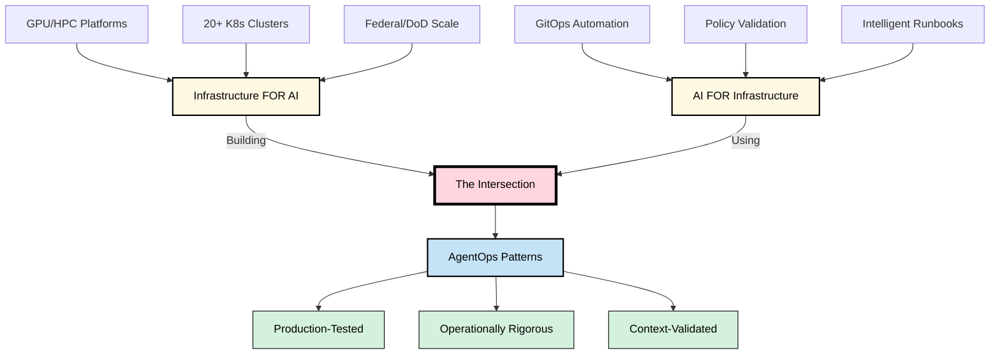
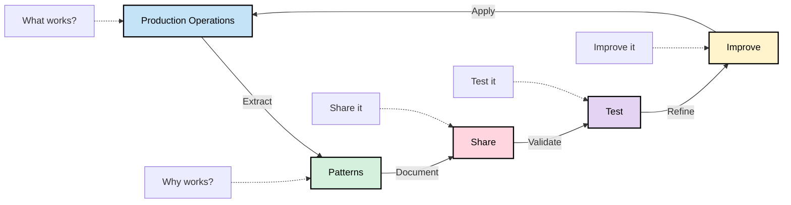
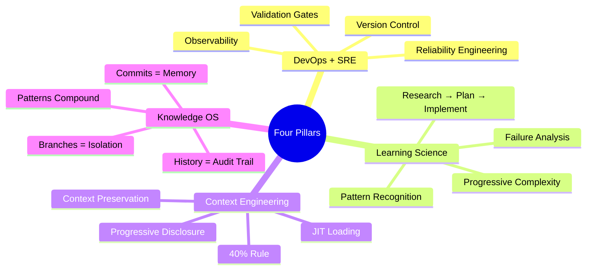
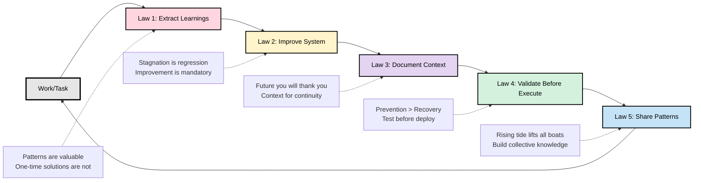
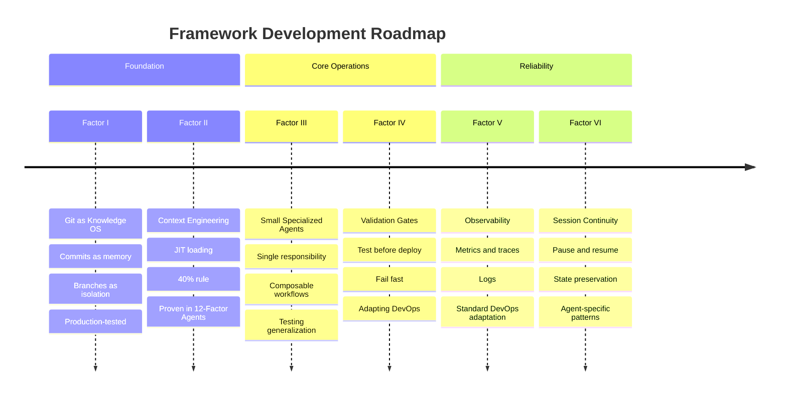

# 12-Factor AgentOps

**Operational patterns from the intersection: infrastructure FOR AI + AI FOR infrastructure**

---

> [!IMPORTANT]
> **Status: Early Exploration** - These patterns work in my production environment (federal infrastructure). Testing if they generalize to other domains. Your feedback will shape what gets published.
>
> **Looking for Context Engineering?** See [12-Factor Agents - Factor 3](https://github.com/humanlayer/12-factor-agents/blob/main/content/factor-03-own-your-context-window.md) by [@dexhorthy](https://github.com/dexhorthy)

> [!NOTE]
> **Built with AI Agents** - This framework was developed using [Claude Code](https://claude.ai/claude-code) and documents operational patterns from AI-powered GitOps workflows. We practice what we document.

---

## The Intersection

I build GPU/HPC platforms that enable AI workloads.

I use AI agents to automate infrastructure operations.

I operate both at production scale in federal, security-hardened environments.

**I'm learning patterns from both sides of the AI equation, and sharing what's working.**

---

## The Problem

Everyone's building AI agents. Nobody's figured out how to operate them reliably.

- **Week 1:** "This is amazing!"
- **Week 4:** Errors piling up
- **Week 8:** Back to manual work

Sound familiar? **It's 2015 microservices chaos all over again.**

We know how to build reliable infrastructure. We know how to build reliable software.

**But operating AI agents in production? We're still figuring that out.**

---

## What This Is

I've spent 10+ years climbing the IT stack—systems, networking, storage, security, platforms, automation. Now I'm at an unusual intersection:

**Building infrastructure FOR AI workloads** (GPU/HPC platforms, 20+ production clusters)
**Using AI agents TO BUILD infrastructure** (GitOps automation, policy validation, runbooks)

**Operating both in production, in high-stakes environments.**

I'm trying to apply the same operational discipline to AI agents that we apply to infrastructure. Some patterns are emerging. This is an attempt to document them as a framework—still figuring out what generalizes and what's context-specific.

---

## Why This Might Be Useful

Most operational patterns for AI agents come from one context:
- Pure AI/ML work (research, training pipelines)
- Pure infrastructure work (no AI agents involved)
- AI agent experimentation (not production)

**I'm trying patterns from a different angle:**
1. Building platforms **FOR** AI workloads (infrastructure mindset)
2. Using AI agents **TO BUILD** platforms (automation mindset)
3. Operating both in production with real consequences

The hypothesis: operational discipline transfers. DevOps patterns that work for infrastructure might work for AI agents. Worth testing.

---

## The Experiment

Here's what I'm doing:

1. **Use patterns** in my production environment (federal infrastructure, real workloads)
2. **Document what works** (and what doesn't)
3. **Extract meta-patterns** that might generalize
4. **Share early** to test the hypothesis with other contexts
5. **Refine** based on what we collectively learn

Not prescriptive. Exploratory. Some will work universally, some won't transfer.

---

## Help Test This

**If you're working with AI agents in operations:**
- Try these patterns in your context
- Report what works (and what doesn't)
- Share adaptations you discover
- Challenge the hypothesis

**If you're in a different domain:**
- Healthcare IT, finance, manufacturing, education—your context matters
- Help prove (or disprove) whether these patterns generalize
- Suggest modifications for your constraints

**Goal:** Figure out together what's universal and what's domain-specific.

---

## The Framework

While factors are being documented, here are the operational principles guiding this work:

### Four Pillars

**DevOps + SRE:** Apply proven infrastructure practices—version control, validation gates, observability, reliability engineering.

**Learning Science:** Research → Plan → Implement. Pattern recognition, failure analysis, progressive complexity.

**Context Engineering:** JIT loading, progressive disclosure, the 40% rule. Manage cognitive load to avoid collapse.

**Knowledge OS:** Git as institutional memory. Commits = memory writes. Branches = isolation. History = audit trail.

### Five Laws of AgentOps

All work follows these mandatory practices:

- **Law 1: ALWAYS Extract Learnings** — Patterns are valuable. One-time solutions are not.
- **Law 2: ALWAYS Improve Self or System** — Stagnation is regression. Continuous improvement is mandatory.
- **Law 3: ALWAYS Document Context for Future** — Future you (or future contributors) will thank you.
- **Law 4: ALWAYS Validate Before Execute** — Prevention is cheaper than recovery.
- **Law 5: ALWAYS Share Patterns Publicly** — Rising tide lifts all boats.

> See [CLAUDE.md](CLAUDE.md) for full details on the AgentOps principles and contribution guidelines.

---

## What's Being Documented

Publishing factors as they stabilize and show promise of generalizing. Early patterns first, then refinements.

### Work in Progress

| Factor | Focus | Status | Why This Order |
|--------|-------|--------|----------------|
| **I: Git as Knowledge OS** | Commits = memory, branches = isolation | Documenting | Foundation - proven in my context, testing generalization |
| **II: Context Engineering** | JIT loading, 40% rule, progressive disclosure | Documenting | Critical for reliability, borrowed from 12-Factor Agents |
| **III: Small Specialized Agents** | Single responsibility, composable workflows | Documenting | Seems universal, want community validation |
| **IV: Validation Gates** | Test before deploy, fail fast | Exploring | Works for infrastructure, testing with agents |
| **V: Observability** | Metrics, logs, traces | Exploring | Standard DevOps, adapting for agent context |
| **VI: Session Continuity** | Pause/resume, state preservation | Exploring | Unique to agents, figuring out patterns |

> [!TIP]
> **Watch this repo** to see factors as they're published and help validate them

---

## Who's Behind This

**My background:**
- 10+ years: Systems → Networks → Security → Platforms → Automation
- Currently: 20+ production Kubernetes clusters (federal/DoD)
- Building: GPU/HPC infrastructure for AI workloads
- Experimenting: AI agents for GitOps automation and policy validation

**Why I'm sharing this:**

I'm at an unusual vantage point—building infrastructure that runs AI workloads while using AI to build that infrastructure. Patterns are emerging that might be useful beyond my context. This is an attempt to extract and test them.

Not claiming expertise in AI agents. Claiming experience in operations. Testing if that transfers.

---

## How to Contribute

This is early-stage exploration. Your input is critical.

**Ways to help:**

- ✅ **Try patterns in your domain** - See if they work outside federal infrastructure
- ✅ **Report failures** - What didn't work is as valuable as what did
- ✅ **Suggest modifications** - How would you adapt for your constraints?
- ✅ **Challenge assumptions** - If something seems wrong, say so
- ✅ **Share your patterns** - What's working in your context?

**No idea is too small. No question is too basic. No challenge is unwelcome.**

See [CLAUDE.md](CLAUDE.md) for contribution guidelines and the AgentOps principles I'm using.

---

## Attribution & Inspiration

This framework builds on foundational work from:

### [12-Factor Apps](https://12factor.net) (Heroku)
The original methodology for building software-as-a-service apps. Established principles for:
- Configuration management
- Dependency isolation
- Stateless processes
- Environment parity

**Their insight:** Operational discipline makes applications reliable and portable.

### [12-Factor Agents](https://github.com/humanlayer/12-factor-agents) (Dex Horthy, HumanLayer)
Framework for building reliable LLM applications. Pioneered:
- Context engineering principles
- Human-in-the-loop patterns
- Agent reliability practices
- Production-grade AI systems

**Their insight:** AI agents need the same rigor as traditional software.

### This Project's Focus

**12-Factor AgentOps** extends these foundations to **operations**:
- Not just building reliable agents (12-Factor Agents covers this)
- Not just building reliable apps (12-Factor Apps covers this)
- **Operating AI agents and infrastructure at production scale**

We document patterns from the intersection: infrastructure FOR AI + AI FOR infrastructure.

---

## Related Work

**If you're building AI agents, read these first:**
- [12-Factor Agents](https://github.com/humanlayer/12-factor-agents) by [@dexhorthy](https://github.com/dexhorthy) - Building reliable LLM applications
- [Building Effective Agents](https://www.anthropic.com/engineering/building-effective-agents) by Anthropic - Agent design patterns
- [The Outer Loop](https://theouterloop.substack.com) by Dex Horthy - AI agent development insights

**If you're operating infrastructure, you know these:**
- [12-Factor Apps](https://12factor.net) - SaaS application methodology
- [Site Reliability Engineering](https://sre.google/books/) - Google's SRE practices
- [DevOps Handbook](https://itrevolution.com/product/the-devops-handbook-second-edition/) - DevOps principles

**This framework sits at the intersection.**

---

## License

Code: [Apache 2.0 License](LICENSE) (permissive, use freely)

Documentation: [CC BY-SA 4.0 License](LICENSE) (share alike, attribute)

Full license text: [LICENSE](LICENSE)

---

**Let's figure out how to make AI agents as reliable as the infrastructure they run on.**

*Exploring patterns from federal infrastructure. Testing if they generalize. Join the experiment.*

