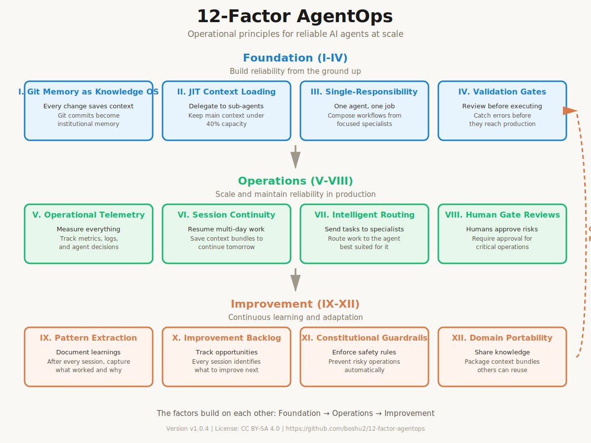
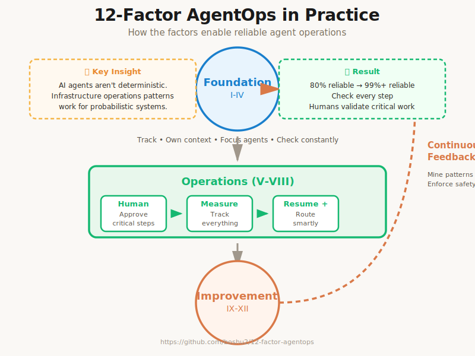

<div align="center">

# 12-Factor AgentOps

**Operational principles for using AI agents reliably at scale.**

[](https://creativecommons.org/licenses/by-sa/4.0/)
[](https://github.com/boshu2/12-factor-agentops/releases/tag/v1.0.0)
[](https://github.com/boshu2/12-factor-agentops)



*[View full-size diagram](./docs/assets/12-factor-landscape.svg)*

</div>

---

## The Driving Question

> ### **How do we take AI agents from 80% reliable to production-grade without throwing away frameworks and rewriting from scratch?**

I've watched too many teams follow the same pattern: build exciting AI features, ship to production, watch it break, add manual review, bottleneck, abandon AI. The framework isn't the problem—the operational model is.

This isn't a guide on how to *build* better AI applications. It's a guide on how to *operate* them reliably. It's inspired by [12-Factor App](https://12factor.net) and adapted from 20+ years of DevOps, SRE, and production operations wisdom—applied to the unique challenges of AI agents.

**The core insight:** AI agents aren't deterministic software. Traditional reliability patterns (code review, unit tests) don't work on probabilistic systems. But infrastructure operations patterns do.

## The Reality

I've seen this pattern happen in dozens of companies:

1. **Week 1:** Build exciting AI agent, demo looks magical
2. **Week 2:** Ship to production, handle a few edge cases
3. **Week 3:** Agent hits unexpected scenario, produces garbage
4. **Week 4:** Manual review becomes mandatory
5. **Week 5:** Review bottleneck kills productivity gains
6. **Week 6:** "We'd be faster without the AI" → Abandon

**The problem isn't the LLM.** It's the operational model.

### Why This Happens

Most teams approaching AI agents follow a pattern borrowed from general software:
- Write deterministic code
- Add AI steps to "magical" parts
- Assume production will be like development
- Hope for the best

But AI fundamentally breaks this model:

| Property | Deterministic Code | AI Agents |
|----------|-------------------|-----------|
| **Input consistency** | Same input → same output | Same input → different output |
| **Error patterns** | Predictable, reproducible | Novel, context-dependent |
| **Testing strategy** | Unit tests, edge cases | Probabilistic sampling, thresholds |
| **Reliability approach** | Logic review, testing | Observability, validation, fallbacks |

**Traditional software engineering doesn't work on probabilistic systems.** But something else does: infrastructure operations.

## The Solution

Over the past 20 years, the operations world has figured out how to run systems that:
- Are partially unreliable (servers fail, networks timeout)
- Span multiple layers (app, infra, data)
- Need continuous adaptation (monitoring, alerting, incident response)
- Fail in novel ways (cascading failures, resource exhaustion)

These patterns from Heroku, Netflix, and the SRE movement apply directly to AI agents.

Instead of trying to make agents deterministic, we:
- **Validate outputs** before deploying them
- **Observe everything** about agent behavior
- **Never trust** a single agent step to work
- **Extract patterns** from each failure and success
- **Continuously improve** the system based on real production data

This framework adapts 12 operational principles from infrastructure operations into 12 factors for reliable AI usage.

## Who This Is For

- **Solo developers** using Claude, ChatGPT, or other AI coding assistants
- **Product teams** building AI-powered features that scale beyond MVP
- **Platform teams** deploying agent-driven automation across infrastructure
- **Enterprises** who need AI agents in customer-facing production systems
- **Anyone** who wants AI to make you faster over time, not slower

**What unites you:** You've hit the wall where "just prompt better" stops working. You need systematic operational approaches.

## The 12 Factors

Even if LLMs continue to get exponentially more powerful, there will be core operational techniques that make AI-agent-powered software more reliable, more maintainable, and easier to run at scale.

### Foundation (I-IV)
Build reliability from the ground up

| Factor | What It Does |
|--------|--------------|
| **[I. Automated Tracking](./factors/01-automated-tracking.md)** | Track everything automatically - builds institutional knowledge through version control |
| **[II. Context Loading](./factors/02-context-loading.md)** | Load only what you need - delegate to sub-agents as much as possible |
| **[III. Focused Agents](./factors/03-focused-agents.md)** | Each agent does one job well - compose workflows from specialists |
| **[IV. Continuous Validation](./factors/04-continuous-validation.md)** | Check at every step - catch errors before they propagate |

### Operations (V-VIII)
Scale and maintain reliability in production

| Factor | What It Does |
|--------|--------------|
| **[V. Measure Everything](./factors/05-measure-everything.md)** | Track metrics and logs - observable performance and agent decisions |
| **[VI. Resume Work](./factors/06-resume-work.md)** | Continue multi-day sessions - save context to pick up where you left off |
| **[VII. Smart Routing](./factors/07-smart-routing.md)** | Send tasks to specialists - route work to the agent best suited for it |
| **[VIII. Human Validation](./factors/08-human-validation.md)** | Humans approve critical steps - ultimate validator for risky operations |

### Improvement (IX-XII)
Continuous learning and adaptation

| Factor | What It Does |
|--------|--------------|
| **[IX. Mine Patterns](./factors/09-mine-patterns.md)** | Search history for patterns - query git, logs, and metrics to find trends |
| **[X. Small Iterations](./factors/10-small-iterations.md)** | Make small improvements continuously - tweak workflows and agents based on patterns |
| **[XI. Fail-Safe Checks](./factors/11-fail-safe-checks.md)** | Prevent repeating mistakes - add hooks and validations to stop bad patterns |
| **[XII. Package Patterns](./factors/12-package-patterns.md)** | Bundle what works for reuse - capture successful workflows as reusable templates |

### How the Factors Work Together

The factors build on each other in three operational layers:

- **Factors I-IV (Foundation)** establish foundational reliability patterns
- **Factors V-VIII (Operations)** enable operational scale and human oversight
- **Factors IX-XII (Improvement)** create feedback loops that compound improvements over time

<div align="center">



*[View workflow flow diagram](./docs/assets/workflow-flow.svg)*

</div>

Each layer enables the next, creating a continuous improvement cycle where learnings from production feed back into your foundation, making the entire system more reliable over time.

---

## How We Got Here

### The Agent Loop Problem

Most agent frameworks follow a loop pattern:

```
1. LLM determines next step (tool call)
2. Deterministic code executes the tool
3. Result appended to context
4. Repeat until LLM says "done"
```

This works great in demos. It breaks in production because:
- Context windows fill up
- Errors compound across steps
- Novel failures aren't in training data
- Recovery paths are unclear
- No observability into why decisions were made

### The Operations Solution

The infrastructure world solved similar problems 20 years ago:
- **Validation gates:** Check before deploying (canary deployments, health checks)
- **Observability:** Metrics on everything, dashboards, alerting
- **Zero-trust:** Assume failures will happen, design for graceful degradation
- **Pattern learning:** Extract signals from logs, incidents, metrics
- **Continuous improvement:** Feedback loops that compound over time

These aren't AI-specific techniques. They're operational fundamentals. Applied to agents, they transform reliability from 70% to 99%+ without rewriting the core logic.

---

## The Philosophy: Constraint-Based Engineering

12-Factor AgentOps is built on **constraint-based engineering**—designing optimal systems within hard limits, not despite them.

AI systems face real constraints:
- **Context windows:** 200k tokens maximum, performance degrades >40%
- **Probabilistic outputs:** Non-deterministic, require validation
- **Cost per token:** Scales linearly, frontier models expensive
- **Latency requirements:** User expectations, real-time vs batch

Federal infrastructure adds more:
- **Air-gapped networks:** Zero internet connectivity
- **Classification boundaries:** Multi-level security isolation
- **Zero vendor support:** Self-sufficient operations required
- **Limited compute:** GPU scarcity, power budgets

The 12 factors are proven constraint-optimization patterns, validated from solo development to DoD/Intelligence Community production environments.

**You can't eliminate constraints. You can only architect optimally within them.**

**[Read more about constraint-based engineering →](./docs/principles/constraint-based-engineering.md)**

---

## Quick Start

**Read the factors above** to understand the methodology. Each factor addresses a specific reliability challenge you'll encounter with AI agents.

**Then explore:**

- **[Workflow Guide](./docs/tutorials/workflow-guide.md)** - See how to apply the factors in practice with a complete Redis Operator example
- **[factors/](./factors/)** - Deep dive into any specific factor
- **[docs/principles/](./docs/principles/)** - Understand the philosophy behind the framework (Five Laws, Four Pillars)

**Want to contribute?** See [CONTRIBUTING.md](./CONTRIBUTING.md) for how to share your implementations and learnings.

---

## The Short Version: The 12 Factors

Read them in order, or jump to what interests you:

- [Factor I: Automated Tracking](./factors/01-automated-tracking.md)
- [Factor II: Context Loading](./factors/02-context-loading.md)
- [Factor III: Focused Agents](./factors/03-focused-agents.md)
- [Factor IV: Continuous Validation](./factors/04-continuous-validation.md)
- [Factor V: Measure Everything](./factors/05-measure-everything.md)
- [Factor VI: Resume Work](./factors/06-resume-work.md)
- [Factor VII: Smart Routing](./factors/07-smart-routing.md)
- [Factor VIII: Human Validation](./factors/08-human-validation.md)
- [Factor IX: Mine Patterns](./factors/09-mine-patterns.md)
- [Factor X: Small Iterations](./factors/10-small-iterations.md)
- [Factor XI: Fail-Safe Checks](./factors/11-fail-safe-checks.md)
- [Factor XII: Package Patterns](./factors/12-package-patterns.md)

---

## How This Relates to Other Work

### vs. [12-Factor App](https://12factor.net) (Adam Wiggins, Heroku)
**12-Factor App** defines principles for building scalable cloud applications.

**12-Factor AgentOps** applies those same *operational* principles specifically to AI agents.

| Area | 12-Factor App | 12-Factor AgentOps |
|------|---------------|-------------------|
| **Focus** | Building scalable apps | Operating reliable agents |
| **Problem Domain** | Deterministic software | Probabilistic systems |
| **Key Pattern** | Configuration and deployment | Validation and observation |

### vs. [12-Factor Agents](https://github.com/humanlayer/12-factor-agents) (Dex Horthy, HumanLayer)
**12-Factor Agents** defines engineering patterns for developers *building* AI applications.

**12-Factor AgentOps** defines operational patterns for teams *using* AI agents in production.

| Dimension | 12-Factor Agents | 12-Factor AgentOps |
|-----------|------------------|-------------------|
| **Audience** | AI app developers | Operations + product teams |
| **Concern** | How to engineer agents | How to operate agents |
| **Scope** | Application design | Operational patterns |
| **When to use** | Building agent systems | Deploying to production |

**Both are complementary.** Use 12-Factor Agents for application design. Use 12-Factor AgentOps for operational reliability.

---

## Why This Works

The 12-factor approach is successful because it's not about AI—it's about operations.

Most teams fail to scale AI not because their LLM isn't smart enough, but because:
1. They have no visibility into what agents are actually doing
2. They trust single-point failures (one agent step) for critical operations
3. They have no way to learn from failures systematically
4. They can't maintain institutional knowledge across team changes
5. They treat AI like traditional software (deterministic testing, code review)

12-Factor AgentOps is a systematic approach to all five problems. It's not revolutionary—it's proven operations practices, finally applied to the right place.

---

## Community & Contributing

This is an open-source methodology. We're building it together.

### Ways to Contribute

**Share your experience** (most valuable):
- Have you implemented these factors? What worked?
- What problems did you hit? How did you solve them?
- Open a discussion: GitHub Discussions

**Contribute domain guides**:
- How do these factors apply to DevOps? Machine Learning? Data Engineering?
- Submit a PR with a domain-specific guide

**Contribute case studies**:
- Document a real production implementation
- Show metrics: before/after reliability, time-to-value, cost
- Submit via PR with anonymization options

**Improve the framework**:
- Found an error or unclear section?
- Better wording for a factor?
- Missing something critical?
- Open an issue or submit a PR

See [CONTRIBUTING.md](./CONTRIBUTING.md) for detailed guidelines.

### Credit & Attribution

This framework builds on 20+ years of operations wisdom from:
- **Heroku** and the 12-Factor App methodology
- **Netflix** and the SRE movement
- **Google** SRE practices (books, talks, publications)
- **Infrastructure community** (Ops, DevOps, SRE worldwide)
- **AI community** pushing on boundaries of what's possible with agents

Special thanks to everyone who's shared production war stories and patterns.

---

## Status

**Version:** v1.0.0
**Released:** November 2025

**What's Included:**
- ✅ All 12 factors documented with detailed explanations
- ✅ Practical workflow guide with slash commands (/prime, /research, /plan, /implement, /learn)
- ✅ Complete example: Redis Operator deployment with Kustomization
- ✅ Validation gates framework between each workflow phase
- ✅ Factor mapping showing operational principles in practice
- ✅ Core principles (Five Laws, Four Pillars) documented

**What We're Looking For:**
- Real-world implementations across different domains
- Quantified before/after metrics (reliability, velocity, cost)
- Edge cases and pain points we haven't discovered
- Domain-specific adaptations of the factors
- Visual diagrams and interactive tools

**Next Steps:**
1. Gather production case studies (3-6 month implementations)
2. Publish domain-specific guides (DevOps, ML, Platform Engineering)
3. Build interactive decision trees for factor selection
4. Create certified training/audit program

---

## License & Citation

<div align="center">

[](https://creativecommons.org/licenses/by-sa/4.0/)
[](https://www.apache.org/licenses/LICENSE-2.0)

</div>

**Content:** CC BY-SA 4.0 (share, adapt, cite)
**Code samples:** Apache 2.0 (use freely in production)

Academic citation: See [CITATION.bib](./CITATION.bib)

```bibtex
@framework{12-factor-agentops-2025,
  title={12-Factor AgentOps: Operational Principles for Reliable AI Agents at Scale},
  author={Fuller, Boden},
  year={2025},
  url={https://github.com/boshu2/12-factor-agentops}
}
```

---

## What's Next?

### For You
Pick one factor that matches your biggest pain point:
- **Context problems?** Start with [Factor II: Context Loading](./factors/02-context-loading.md)
- **Reliability issues?** Start with [Factor IV: Continuous Validation](./factors/04-continuous-validation.md)
- **Observability blind?** Start with [Factor V: Measure Everything](./factors/05-measure-everything.md)
- **Want to understand deeply?** Start with [Workflow Guide](./docs/tutorials/workflow-guide.md)

### For the Framework
We're actively seeking:
- Production case studies (yours!)
- Domain-specific implementations
- Visual diagrams and decision trees
- Community patterns and variants

**Join us.** Let's figure out how to make AI agents work reliably at scale, together.

---

*Built on proven operational principles. Adapted for the AI age. Open source. Community validated.*

**Version:** v1.0.4 Beta | **Status:** Production-ready, community validation in progress | **License:** CC BY-SA 4.0 (content) + Apache 2.0 (code)
